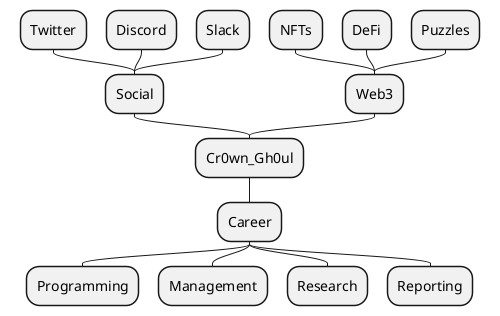

# Cr0wn_Gh0ul: Emulating Digital Presence

## Abstract
Cr0wn_Gh0ul is a multi-agent system designed to replicate an individual’s online persona with remarkable fidelity. By analyzing linguistic habits, content preferences, and engagement styles, this framework aims to produce an autonomous presence on social platforms, professional networks, and Web3 communities without resorting to superficial parody. Rather, its focus is on preserving nuance and authenticity in every interaction.

---

## Introduction
Modern online interactions span an ever-growing range of channels—social media sites, community servers, professional hubs, and decentralized applications. Staying consistently active on all these fronts can be both exhausting and time-consuming. Cr0wn_Gh0ul addresses this challenge by coordinating specialized agents, each adept at handling a particular category of tasks, to manage and maintain a cohesive digital identity. By melding traditional social media integrations with cutting-edge Web3 features, this framework offers a robust method for ensuring a unified, authentic online presence across multiple domains.

---

## Objective
The overarching goal of Cr0wn_Gh0ul is to offer a comprehensive system that:

1. **Mirrors Real Activity**  
   Accurately reflects the patterns, tones, and habits of the user’s daily interactions.

2. **Maintains Authenticity**  
   Upholds the individuality of the persona, ensuring that outputs feel like natural continuations of the user’s genuine voice.

3. **Navigates Diverse Contexts**  
   Engages effectively across channels ranging from social media conversations to career-centric platforms.

---

## Scope
Cr0wn_Gh0ul targets three primary realms of digital engagement:

- **Social**  
  Focuses on platforms like Twitter, Discord, and Slack, facilitating chats, updates, and real-time engagement.

- **Web3**  
  Tackles emerging decentralized ecosystems, including non-fungible token marketplaces, decentralized finance platforms, and puzzle-based communities.

- **Career**  
  Supports professional activities such as programming-related discussions, managerial decision-making, research communication, and structured reporting.

## Framework Evaluation
Early explorations looked at a variety of options:

- **Eliza**  
  Suited for quick prototypes and simple experiments, but lacked the capacity for intricate, low-level integrations that enterprise use cases demand.

- **Virtuals G.A.M.E**  
  Useful for generating virtual agents in a straightforward manner. However, it did not offer the advanced instrumentation necessary to handle the complexity of Cr0wn_Gh0ul’s production requirements.

Based on these evaluations, the project pivoted to a more versatile and modern approach.

---

## Chosen Framework
Cr0wn_Gh0ul integrates a suite of tools purpose-built for LLM-driven applications:

1. **LangChain**  
   - **Purpose**: Enables chaining various components—models, prompts, and tools—into cohesive workflows.  
   - **Value**: Simplifies the process of generating complex text-based operations from multiple data sources.

2. **LangGraph**  
   - **Purpose**: Designed for multi-actor, stateful LLM applications where non-linear logic is essential.  
   - **Value**: Provides structure for orchestrating dynamic workflows that involve multiple Agents exchanging information.

3. **LangSmith**  
   - **Purpose**: Offers a platform to build, debug, and monitor LLM-centric applications end-to-end.  
   - **Value**: Ensures reliability in large-scale deployments by facilitating real-time performance insights and iterative refinement.

Through this combination, Cr0wn_Gh0ul can manage intricate tasks across different domains while maintaining coherence and consistency.

---

## Implementation Strategy
1. **Data Gathering**  
   Collect text samples and user interactions from platforms of interest to learn linguistic habits, frequently used terminology, and behavioral cues.

2. **Model Customization**  
   Leverage LangChain to develop tailored language models that mimic the user’s communicative style, integrating learned data into prompt-engineered workflows.

3. **Workflow Design**  
   Use LangGraph to script dynamic processes: routing tasks to the right Agent, coordinating domain-specific tool usage, and keeping track of global context.

4. **Testing & Refinement**  
   Employ LangSmith to simulate real-world usage, gather logs, and continuously fine-tune model behaviors, ensuring the system’s outputs remain aligned with the user’s identity.

---

## Challenges and Considerations
- **Privacy & Compliance**  
  Ensuring that personal data is handled securely and in compliance with relevant legal and ethical guidelines.

- **Ethical Boundaries**  
  Establishing clear protocols for consent and responsible usage when deploying a system that can impersonate real individuals.

- **Complex Integrations**  
  Juggling the complexities of connecting various APIs, toolkits, and legacy systems while maintaining a singular, unified persona.

---

## Conclusion
Cr0wn_Gh0ul paves the way for a new era of automated digital identity management. By orchestrating a Supervisor Agent, specialized domain Agents, and targeted toolsets, it delivers a platform for authentically representing an individual’s online activities at scale. As the digital landscape continues to broaden—encompassing social, Web3, and professional spheres—Cr0wn_Gh0ul stands ready to adapt, grow, and maintain the genuine touch that users value in their online interactions.

