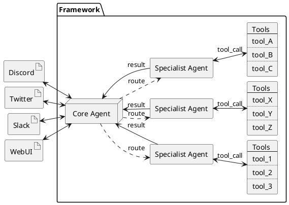

# Multi-Agent Framework: Mirroring Human Personas

In everyday life, individuals take on multiple roles—each with its own focus, responsibilities, and specialized knowledge. A person might be a software engineer in the office, a community organizer at local events, and a hobbyist musician in their free time. These contexts require unique skill sets and communication styles, yet they coexist within the same individual. Similarly, the multi-agent framework in Cr0wn_Gh0ul encapsulates specialized agents for different domains (e.g., social media, Web3, career), ensuring that each agent can develop deep expertise without being diluted by general-purpose requirements.

Rather than overloading a single “generalist” agent, Cr0wn_Gh0ul delegates tasks to distinct agents that excel in their respective areas—much like how a human’s professional persona might handle a business presentation, while a personal persona enjoys casual banter on social media. This segmentation of roles leads to more authentic and context-aware interactions, as each agent is trained with the rules, norms, and conversational tone that best suits its domain. Crucially, a central Supervisor Agent mediates the flow of information and maintains a unified sense of identity, ensuring that while each agent is specialized, they still collectively represent the same underlying persona in a coherent manner.

This division of labor not only boosts efficiency but also preserves a “human-like” authenticity. Much as a real person may instinctively switch between professional jargon in work emails and informal slang in private messages, Cr0wn_Gh0ul’s specialized agents produce responses tailored to the expectations and nuances of each platform or context. The result is a system that more faithfully mirrors the multifaceted nature of human day-to-day interactions, delivering the right level of expertise and tone in every situation.

---

The system is organized around a central **Core Agent** that delegates tasks to a set of specialized **Specialist Agents**. Each Agent has access to different tools appropriate for the domain it serves. Below is a high-level description of the architecture:

1. **Interfaces**  
   - **Inbound/Outbound Gateways**: These are the external points of contact like Discord, Twitter, Slack, or a web-based UI. Incoming requests and outgoing responses flow through these gateways.

2. **Supervisor Agent**  
   - **Coordination**: Decides which specialized Agent is best suited to handle an incoming request or conversation.  
   - **State Management**: Maintains context across interactions to ensure continuity in the persona’s voice and style.  
   - **Result Aggregation**: Collects final outputs from various Agents and dispatches them back through the appropriate interface.

3. **Specialist Agents**  
   - **Tasks**: Each Agent focuses on a particular domain, such as social interactions, Web3 strategies, or career-related functions.  
   - **Tools**: The Agents rely on distinct toolkits, enabling them to handle domain-specific tasks—be it monitoring market trends, scheduling content, or synthesizing research findings.

4. **Tools**  
   - **Domain-Focused Libraries**: Provide specialized functionality, from data analytics and social API bindings to blockchain event monitoring.  
   - **Automation Utilities**: Facilitate post scheduling, content generation, and more.  
   - **Extensions**: Additional modules that can be plugged in or replaced as requirements evolve.

## Future 

### Open-Source Framework
The framework is currently under active development and not yet open source. Once it reaches a stable version, it will be released as an open-source project, starting with a limited group of tester developers for initial feedback and improvements.

Key features of the framework include:
- **Quick Setup**: Users can create a configuration file and personality file to get the system operational with minimal effort.
- **Enhanced Personalization**: Tools are in development to fine-tune the core agent’s persona by leveraging data from social media and communication platforms, offering more depth than a standalone personality file.
- **Modular Design**: The framework is designed for flexibility, allowing users to seamlessly add and configure specialized agents to meet specific requirements, making it adaptable for diverse use cases.
